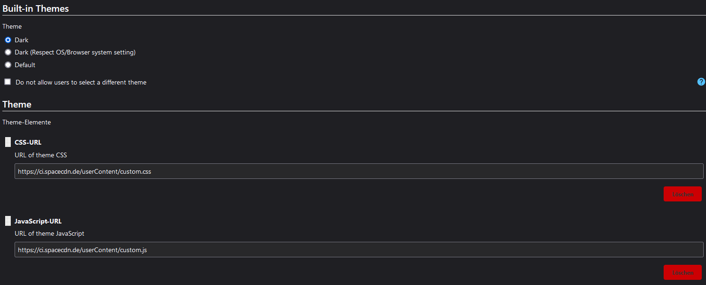
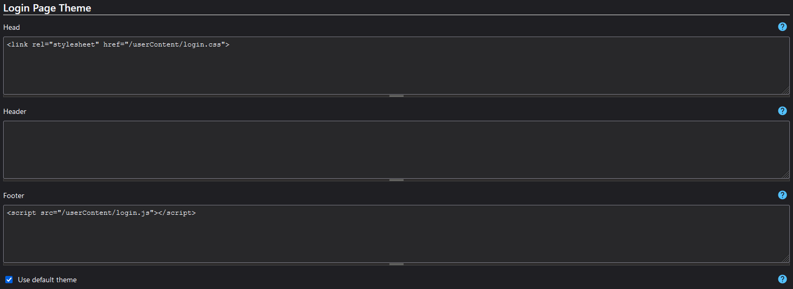

# Jenkins style

For setup just clone this repository to `$JENKINS_HOME/userContent`
For most envoriments this is: `/var/lib/jenkins/userContent`

## The Following settings need to be configured:
#### Theme elements:

#### Login-Page Theme

